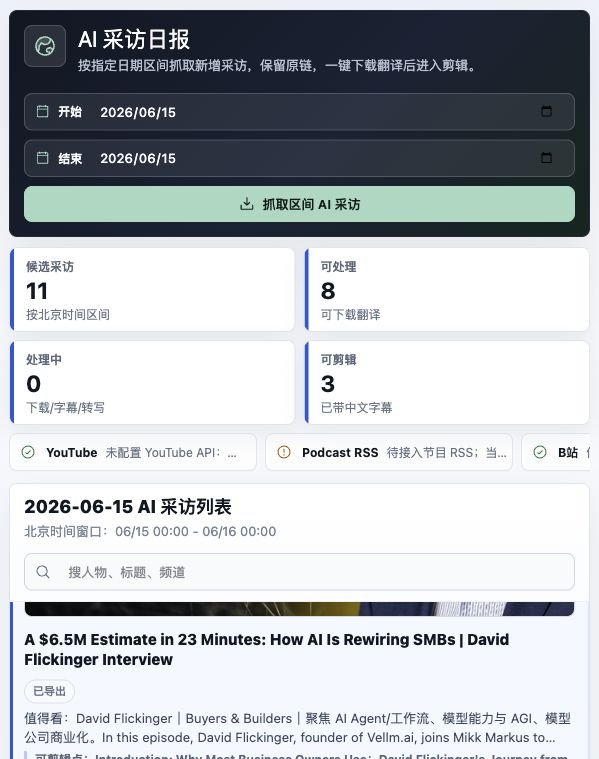

# Tech PR Workbench

Local-first AI interview discovery, Chinese subtitle translation, and authorized clip preparation for tech PR teams.

Tech PR Workbench 帮科技公司 PR、内容运营和创始人办公室把公开视频采访变成可复核的日报和可剪辑素材：先发现 AI/科技采访，保留原始链接和嘉宾线索，再为授权视频生成中文字幕、推荐高光片段并导出剪辑序列。

> 默认定位：个人或小团队本地工具。请只下载、剪辑和再发布你有权处理的素材。

## Highlights

- 按日期区间抓取 AI 采访候选：YouTube 优先，B 站补充。
- 汇总标题、来源、发布时间、人物识别、中文摘要和原始链接。
- 下载授权素材后，自动拉取字幕、生成中文字幕，并给出高光建议。
- 用“采访发现 / 处理任务 / 剪辑工作台”三个视图完成本地流程，刷新后自动恢复日期、当前视频和剪辑草稿。
- 导出 VTT/SRT 字幕、剪辑表 CSV，以及带中文字幕的 16:9 或 9:16 序列视频。

## Quick Start

```bash
git clone https://github.com/judefluen-coder/tech-pr-workbench.git
cd tech-pr-workbench
npm run doctor
npm run setup
npm run dev
```

打开 `http://127.0.0.1:5173`。后端默认运行在 `http://127.0.0.1:8000`。

## 截图导览

### 1. AI 采访日报



这个页面用于每天判断“有哪些视频值得进入下一步”：

- 顶部日期区间：选择要看的日期，例如昨天，或 6 月 1 日到 6 月 13 日。
- 抓取按钮：运行 YouTube/B 站发现流程，刷新候选采访。
- 数据概览：显示候选数量、可处理数量、处理中数量、已可剪辑数量。
- 来源状态：告诉你 YouTube、B 站、RSS 等来源当前是否可用。
- 视频列表：逐条展示标题、来源、人物识别、摘要、观看量和时长。
- 操作按钮：打开原始链接，或点击“下载并翻译”进入处理流程。

人物标签有三类：

- `追踪：某人`：命中了你的重点人物池。
- `识别：某人`：系统从标题、简介或字幕中识别出的采访嘉宾。
- `人物待确认`：标题、简介和已有字幕里暂时没有明确嘉宾。

### 2. 剪辑工作台


这个页面用于把一条采访变成可发布素材：

- 视频播放器：播放已经下载到本地的视频。
- 中文字幕：下载翻译完成后，字幕会随视频时间同步。
- 时间线：显示系统推荐的高光片段、当前选区和已加入的剪辑序列。
- 入点/出点：像剪辑软件一样选择片段起点和终点。
- 高光建议：系统根据字幕中的观点词、AI 议题和表达密度推荐片段。
- 重新处理字幕：使用本地已有字幕重新清理和翻译，不重复下载视频，也不会移除已有剪辑片段。
- 导出序列视频：把剪辑序列里的片段拼成一个 MP4，可选择横版、竖版、裁切/完整适配、字幕模板和品牌 Logo。

当前产品化开发范围与阶段进度见 [Local Studio v1 Roadmap](docs/ROADMAP.md)。

## 典型工作流

1. 打开 `http://127.0.0.1:5173`。
2. 选择日期区间，点击“抓取区间 AI 采访”。
3. 浏览候选列表，看摘要、人物标签和原始链接。
4. 对值得处理的视频点击“下载并翻译”。
5. 完成后进入剪辑工作台，查看中文字幕和高光建议。
6. 设入点/出点，或把推荐高光加入剪辑序列。
7. 点击“导出序列视频”，选择保存位置和文件名。

## 默认是否收费

默认配置不依赖额外付费 API：

- `yt-dlp`、FFmpeg、SQLite、Argos Translate、本地 Ollama 都是本机工具或开源软件，本项目不会向它们按量付费。
- YouTube Data API 用于发现公开视频元数据，主要受每日 quota 限制；默认配额可能不够大规模生产使用。
- OpenAI API 不参与默认流程，也不会默认安装 SDK。只有当你额外安装 `backend[cloud-ai]`、设置 `CLOUD_AI_ENABLED=true` 并提供 `OPENAI_API_KEY` 时，才会调用云端付费模型。
- GitHub 公共仓库可免费托管代码；如果你启用额外的私有团队、Actions 大量 CI、Packages 等能力，可能进入 GitHub 自身的计费范围。

## 平台支持

已在 macOS 本地开发和测试。Linux 通常可以直接运行。Windows 建议优先使用 WSL2；原生 Windows 也可以尝试，但需要确保依赖都在 PATH 中。

基础依赖：

- Node.js >=20.19.0 或 >=22.12.0
- uv

媒体功能依赖：

- FFmpeg：用于稳定合并 YouTube 音视频、抽音频和导出剪辑。缺失时仍可安装并启动项目，下载会尝试单文件格式，但能力会受限。

可选依赖：

- YouTube Data API key：提升 YouTube 发现稳定性。
- opencli：无 YouTube API key 时补充搜索。
- Ollama：本地大模型翻译备用。
- faster-whisper：没有字幕时做本地转写。
- XiaDown：外部下载器，当前不作为内置下载引擎自动安装。

macOS 可用 Homebrew 安装基础依赖：

```bash
brew install node uv ffmpeg
```

## 依赖完整性

把 GitHub 链接发给别人后，对方只要能 clone 仓库，并且本机已经有基础依赖，就可以本地运行。项目不是完全自包含安装包，所以不会把你电脑上的 FFmpeg、opencli、Ollama 或 API key 一起带过去。

`npm run setup` 会自动安装：

- 后端 Python 依赖：FastAPI、yt-dlp、Argos Translate、本地测试依赖等。
- 前端 npm 依赖：React、Vite、图标、表格等。
- `.env`：如果不存在，会从 `.env.example` 复制一份。

用户需要自己先准备：

- Node.js / npm：Node 需要 >=20.19.0 或 >=22.12.0
- uv
- FFmpeg：建议安装；缺失时 `npm run setup` 不再中断，但视频下载合并、抽音频和导出会受限

可选增强不会自动安装：

- `opencli`：没有 YouTube API key 时，用来补充 YouTube 搜索。没有它也能运行，只是发现覆盖率会下降。
- Ollama：本地大模型翻译备用。没有它时，系统会优先用原中文字幕或 Argos 本地翻译。
- `faster-whisper`：没有字幕时做本地转写，需要手动安装 `backend[local-asr]`。
- OpenAI SDK：默认不安装，只有用户显式启用云端 AI 时才安装 `backend[cloud-ai]`。
- XiaDown：当前不是内置下载引擎，可以作为外部下载器使用；下载好的授权素材再导入工作台处理。
- YouTube API key / OpenAI key：必须用户自己申请并写入 `.env`。

可以让对方先运行：

```bash
npm run doctor
```

它会检查基础依赖，并提示哪些可选工具缺失以及影响。

`npm run setup` 会在缺少 FFmpeg 时继续安装项目依赖；这是为了让干净机器先把应用跑起来。真正处理视频前仍建议安装 FFmpeg。

如果对方准备把 GitHub 链接丢给 Codex、Claude Code、Cursor 等本地 coding agent，让大模型帮忙安装，请看 [Setup With A Coding Agent](docs/AI_AGENT_SETUP.md)。里面有可直接复制的提示词，以及哪些依赖能自动装、哪些需要用户自己提供授权或 API key。

## 启动细节

```bash
git clone https://github.com/judefluen-coder/tech-pr-workbench.git
cd tech-pr-workbench
npm run doctor
npm run setup
npm run dev
```

打开：

```text
http://127.0.0.1:5173
```

`npm run setup` 会：

- 如果 `.env` 不存在，从 `.env.example` 复制一份。
- 安装后端依赖，包括本地翻译依赖。
- 安装前端依赖。

`npm run dev` 会同时启动：

- Backend: `http://127.0.0.1:8000`
- Frontend: `http://127.0.0.1:5173`
- Worker: 持久处理下载、字幕重处理和视频导出任务

浏览器刷新或服务重启不会丢失排队任务；中断的 worker 任务会在下次启动时自动恢复。失败任务可以在网页状态栏直接重试。

## Docker Compose 模式

已经安装 Docker Desktop 的机器可以只用 Docker Compose 启动可复现的网页、API 和 worker：

```bash
docker compose up --build
```

然后打开 `http://127.0.0.1:5173`。数据库、下载素材和导出文件都保存在仓库的 `storage/` 中；停止服务使用 `docker compose down`。

Docker 模式适合在干净机器上快速部署，但容器不能直接调用宿主机的 OpenCLI 浏览器窗口，因此 YouTube 发现会使用 API key 或 yt-dlp 回退。需要 OpenCLI 可视浏览器抓取时，请使用上面的原生 `npm run dev` 模式。Docker 中的“下载文件夹/桌面”导出会映射到 `storage/Downloads/` 或 `storage/Desktop/`。

## 配置

编辑 `.env`：

```env
YOUTUBE_API_KEY=
ARGOS_TRANSLATE_ENABLED=true
LOCAL_ASR_ENABLED=false
DOWNLOAD_ENGINE=yt-dlp
LOCAL_YTDLP_DISCOVERY=true
OPENCLI_DISCOVERY_ENABLED=true
OPENCLI_WINDOW_MODE=background
OPENCLI_PREFLIGHT_ENABLED=false
BILIBILI_DISCOVERY_ENABLED=true
```

建议第一步先不配置 OpenAI。需要更稳定的 YouTube 发现结果时，再配置 `YOUTUBE_API_KEY`。

`OPENCLI_WINDOW_MODE=background` 是默认推荐值：抓取时不会抢走当前工作台页面。只有在调试 opencli 浏览器插件连接问题时，才建议临时改成 `foreground` 并开启 `OPENCLI_PREFLIGHT_ENABLED=true`。

如果确实需要 OpenAI 作为云端转写/翻译兜底：

```bash
uv sync --project backend --extra cloud-ai
```

然后在 `.env` 中设置：

```env
CLOUD_AI_ENABLED=true
OPENAI_API_KEY=你的 key
```

如果需要本地 Whisper 转写：

```bash
uv sync --project backend --extra local-asr
```

然后在 `.env` 中设置：

```env
LOCAL_ASR_ENABLED=true
```

## 字幕和下载策略

点击“下载并翻译”后，系统按顺序尝试：

1. 下载原视频和可用字幕。
2. 如果已有中文字幕，直接导入。
3. 如果只有英文字幕，用本地翻译生成中文字幕。
4. 如果没有字幕，并且启用了本地 ASR 或云端 AI，再做转写和翻译。

导出序列视频时，系统会读取剪辑序列中的全部片段，拼接成一个 MP4。导出面板支持原尺寸、1920×1080 横版和 1080×1920 竖版，可选择裁切填满或完整画面、主体横向位置、字幕模板与安全区，并可上传品牌 Logo 叠加到四个角位。

## 合规提醒

- 日报发现阶段只保存元数据和原始链接。
- 自动下载用于本地剪辑工作流，请确保你有权下载、编辑和导出该视频。
- 不要提交 `.env`、`storage/` 里的数据库、下载视频、导出视频或字幕文件。
- 如果平台条款或素材授权不允许下载，请只保留原始链接，或导入你已经获得授权的本地素材。

## 测试

```bash
npm run test
```

或分别运行：

```bash
npm run test:backend
npm run build:frontend
```

## 常见问题

### 没有 YouTube API key 能用吗？

能用，但发现覆盖率会下降。系统会尝试本机 opencli/yt-dlp 搜索和 B 站来源。要稳定追踪大量人物，建议配置 YouTube Data API key。

### 为什么有些视频显示“人物待确认”？

这表示标题、简介和已有字幕里没有明确采访嘉宾。下载翻译完成后，系统会用字幕再识别一次。

### 剪辑序列导出的是哪些视频？

导出序列视频会读取当前视频的剪辑序列，把你加入序列的所有片段按顺序拼接。没有加入序列的高光建议不会自动进入导出。

### 可以给非技术用户用吗？

可以作为本地工具使用。当前版本仍需要安装 Node.js、uv 和 FFmpeg；如果要完全给非技术同事使用，下一步建议做 macOS `.app` 或 Docker Desktop 一键包。
